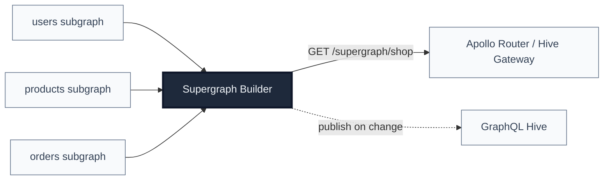

<div align="center">

# Supergraph Builder

**Continuously composes Apollo Federation subgraph schemas into a supergraph SDL that any Federation-compatible gateway (Apollo Router, Hive Gateway) can serve.**

[](https://github.com/revisium/supergraph-builder/releases/latest)
[](https://github.com/revisium/supergraph-builder/blob/master/LICENSE)
[](https://www.typescriptlang.org/)
[](https://nestjs.com/)



</div>

---

## Table of contents

- [What it does](#what-it-does)
- [How it works](#how-it-works)
- [Quick start (60 seconds)](#quick-start-60-seconds)
- [Configuration](#configuration)
  - [Subgraphs and projects](#subgraphs-and-projects)
  - [Authentication headers](#authentication-headers)
  - [Server](#server)
  - [GraphQL Hive (optional)](#graphql-hive-optional)
- [Use the supergraph from a gateway](#use-the-supergraph-from-a-gateway)
- [Deployment](#deployment)
- [Operations](#operations)
- [API reference](#api-reference)
- [Compatibility](#compatibility)
- [Development](#development)
- [License](#license)

---

## What it does

Apollo Federation gateways need a **single composed supergraph SDL** to route incoming GraphQL operations across many subgraph services. Maintaining that SDL by hand — or rebuilding it every time a subgraph deploys — is fragile.

Supergraph Builder runs as a small NestJS service that:

1. Polls each configured subgraph's `_service { sdl }` introspection endpoint.
2. Detects when any subgraph's schema has changed.
3. Recomposes the supergraph SDL using `@apollo/composition`.
4. Exposes the current supergraph at `GET /supergraph/<project>` for your gateway to pull.
5. Optionally publishes the change to a schema registry ([GraphQL Hive](https://the-guild.dev/graphql/hive)).

The gateway becomes effectively stateless with respect to schema management: it pulls the supergraph from this service on a schedule and reconfigures itself.

## How it works

A **project** is a named group of subgraphs that get composed together. One Supergraph Builder instance can serve many projects.

You configure each project entirely through environment variables. The naming convention encodes both the project and the subgraph:

```
SUBGRAPH_<PROJECT>_<SERVICE>=<url>
```

For example, `SUBGRAPH_SHOP_USERS=http://users:4001/graphql` registers a subgraph named `users` in a project named `shop`. The composed supergraph for that project becomes available at `GET /supergraph/shop`.

On startup, the service performs an initial fetch and composition for every project — any failure here is fatal (the process exits). Once running, each project polls its subgraphs every `POLL_INTERVAL_S` seconds (default 60), recomposes only when at least one schema hash has changed, and serves the latest result via the HTTP endpoint.

## Quick start (60 seconds)

The fastest way to see it work is Docker Compose. The example below uses [Apollo's reference subgraphs](https://github.com/apollographql/apollo-server/tree/main/packages/apollo-server-integration-testsuite/src/__fixtures__/starwars-federation) — replace with your own services.

```yaml
# docker-compose.yml
services:
  users:
    image: ghcr.io/example/users-subgraph:latest # your subgraph here
    ports: ['4001:4001']

  products:
    image: ghcr.io/example/products-subgraph:latest # your subgraph here
    ports: ['4002:4002']

  supergraph-builder:
    image: revisium/supergraph-builder:v0.3.0
    ports: ['8080:8080']
    environment:
      SUBGRAPH_SHOP_USERS: http://users:4001/graphql
      SUBGRAPH_SHOP_PRODUCTS: http://products:4002/graphql
      SUBGRAPH_SHOP_POLL_INTERVAL_S: '30'
    depends_on: [users, products]
    healthcheck:
      test: ['CMD', 'wget', '-qO-', 'http://localhost:8080/health/readiness']
      interval: 10s
      retries: 3
```

```bash
docker compose up -d
# Wait a couple of seconds for the initial fetch, then:
curl http://localhost:8080/supergraph/shop
```

You should see a composed supergraph SDL printed to stdout. Point your gateway at that URL and you're done.

## Configuration

### Subgraphs and projects

| Variable                                                | Default | Description                                                          |
| ------------------------------------------------------- | ------- | -------------------------------------------------------------------- |
| `SUBGRAPH_<PROJECT>_<SERVICE>`                          | —       | Subgraph GraphQL endpoint URL **(required)**                         |
| `SUBGRAPH_<PROJECT>_<SERVICE>__HEADER_<HEADER_NAME>`    | —       | Custom HTTP header sent on the SDL introspection request (see below) |
| `SUBGRAPH_<PROJECT>_POLL_INTERVAL_S`                    | `60`    | Polling interval in seconds                                          |
| `SUBGRAPH_<PROJECT>_MAX_RUNTIME_ERRORS`                 | `5`     | Per-fetch retry budget before the polling cycle is marked failed     |

The project name (`<PROJECT>`) is whatever you choose. Service names (`<SERVICE>`) become the subgraph identifiers Apollo Federation uses during composition — pick names that match your subgraphs' `@key` and `@requires` directives.

**Multiple projects** in one instance:

```bash
SUBGRAPH_SHOP_USERS=http://users:4001/graphql
SUBGRAPH_SHOP_PRODUCTS=http://products:4002/graphql

SUBGRAPH_ANALYTICS_EVENTS=http://events:4003/graphql
SUBGRAPH_ANALYTICS_METRICS=http://metrics:4004/graphql
```

Each project gets its own endpoint: `/supergraph/shop`, `/supergraph/analytics`.

### Authentication headers

If a subgraph requires authentication for SDL introspection — an API key, a bearer token, a custom header — attach headers to that subgraph using the `__HEADER_` separator:

```
SUBGRAPH_<PROJECT>_<SERVICE>__HEADER_<HEADER_NAME>=<value>
```

The header name is lowercased and underscores become hyphens. `X_API_KEY` → `x-api-key`, `AUTHORIZATION` → `authorization`.

```bash
# URL of a subgraph behind an API gateway
SUBGRAPH_SHOP_USERS=https://users.example.com/graphql

# Sent on the wire as: x-api-key: secret-123
SUBGRAPH_SHOP_USERS__HEADER_X_API_KEY=secret-123

# Sent on the wire as: authorization: Bearer eyJhbGc...
SUBGRAPH_SHOP_USERS__HEADER_AUTHORIZATION='Bearer eyJhbGc...'
```

Behavior:

- Multiple headers per subgraph are supported (one env var per header).
- Headers are scoped to a single subgraph — configuring `users` doesn't affect `products`.
- `Content-Type: application/json` is always set by the fetcher and cannot be overridden (case-insensitive).
- Empty values are skipped — convenient for Kubernetes `secretKeyRef`s that may be temporarily missing during a rollout.
- Header **values** are never logged. Startup logs print only the header **names** configured for each subgraph.

In Kubernetes, wire each header to a `Secret` key:

```yaml
env:
  - name: SUBGRAPH_SHOP_USERS
    value: 'https://users.example.com/graphql'
  - name: SUBGRAPH_SHOP_USERS__HEADER_X_API_KEY
    valueFrom:
      secretKeyRef:
        name: app-secret
        key: USERS_API_KEY
```

### Server

| Variable | Default | Description      |
| -------- | ------- | ---------------- |
| `PORT`   | `8080`  | HTTP server port |

### GraphQL Hive (optional)

When configured, every detected schema change is published to a [GraphQL Hive](https://the-guild.dev/graphql/hive) target.

| Variable                               | Description                         |
| -------------------------------------- | ----------------------------------- |
| `SUBGRAPH_<PROJECT>_HIVE_TARGET`       | Hive project target ID              |
| `SUBGRAPH_<PROJECT>_HIVE_ACCESS_TOKEN` | Hive API access token               |
| `SUBGRAPH_<PROJECT>_HIVE_AUTHOR`       | Author name for schema publications |

All three must be set for publishing to be enabled.

## Use the supergraph from a gateway

The endpoint serves plain SDL with `Content-Type: text/plain`:

```bash
curl http://localhost:8080/supergraph/shop
```

**Apollo Router** reads its supergraph from a file path and supports hot reload. The recommended deployment pattern is a small sidecar that polls this service and writes the result to a shared volume:

```yaml
# Pseudocode for the sidecar loop
while true; do
  curl -fsSL http://supergraph-builder/supergraph/shop -o /shared/supergraph.graphql
  sleep 30
done
```

```bash
APOLLO_ROUTER_SUPERGRAPH_PATH=/shared/supergraph.graphql \
./router --hot-reload --config router.yaml
```

This decouples the gateway from supergraph-builder's availability: a failed fetch leaves the last good SDL in place. **Hive Gateway** has a similar pattern with `--supergraph` pointed at the same file.

## Deployment

### Docker

```bash
docker run -d --name supergraph-builder -p 8080:8080 \
  -e SUBGRAPH_SHOP_USERS=http://users:4001/graphql \
  -e SUBGRAPH_SHOP_PRODUCTS=http://products:4002/graphql \
  revisium/supergraph-builder:v0.3.0
```

### Docker Compose

See the [Quick start](#quick-start-60-seconds) section above.

### Kubernetes

A minimal manifest. Most production deployments wrap this in a Helm chart with `secretKeyRef` for any auth headers (see [Authentication headers](#authentication-headers)).

```yaml
apiVersion: apps/v1
kind: Deployment
metadata:
  name: supergraph-builder
spec:
  replicas: 1
  selector:
    matchLabels: { app: supergraph-builder }
  template:
    metadata:
      labels: { app: supergraph-builder }
    spec:
      containers:
        - name: supergraph-builder
          image: revisium/supergraph-builder:v0.3.0
          ports: [{ containerPort: 8080 }]
          env:
            - name: SUBGRAPH_SHOP_USERS
              value: 'http://users:4001/graphql'
            - name: SUBGRAPH_SHOP_PRODUCTS
              value: 'http://products:4002/graphql'
          readinessProbe:
            httpGet: { path: /health/readiness, port: 8080 }
            periodSeconds: 5
          livenessProbe:
            httpGet: { path: /health/liveness, port: 8080 }
            periodSeconds: 10
---
apiVersion: v1
kind: Service
metadata:
  name: supergraph-builder
spec:
  selector: { app: supergraph-builder }
  ports: [{ port: 80, targetPort: 8080 }]
```

## Operations

### Health endpoints

- `GET /health/readiness` — 200 once the service has successfully fetched and composed every configured project at least once. Use this for traffic gating.
- `GET /health/liveness` — 200 while the process is alive. Use this for restart decisions.

### Polling and retries

Each subgraph fetch retries on transient HTTP failures with exponential backoff and ±25 % jitter, capped at 30 seconds:

| Retry attempt | Backoff window  |
| ------------- | --------------- |
| 1             | 750 – 1250 ms   |
| 2             | 1500 – 2500 ms  |
| 3             | 3000 – 5000 ms  |
| 4             | 6000 – 10000 ms |
| 5+            | up to 30000 ms  |

The total retry budget per fetch is `SUBGRAPH_<PROJECT>_MAX_RUNTIME_ERRORS` (default 5).

### What happens when a subgraph is unreachable

- **At startup**: the initial bootstrap fetch is fatal. After exhausting retries the process exits with code 1, allowing the orchestrator (Docker / Kubernetes / systemd) to restart it. This avoids serving a partial supergraph composed from stale data.
- **During polling**: a failed fetch cycle is also fatal — the process exits. The rationale is the same: rather than freezing on a known-stale supergraph, the service surfaces the failure to its supervisor. The previously-composed SDL remains available until the process is restarted by the orchestrator.

### Logs

Startup prints every configured project, its poll interval, and each subgraph URL (with header **names** if any are configured, never values). During operation:

```
[INFO] Project "shop" polling every 30s
[INFO]  - Subgraph "users" at https://users.example.com/graphql [headers: x-api-key]
[INFO]  - Subgraph "products" at https://products.example.com/graphql
[WARN] Retry attempt 2/6 for https://users.example.com/graphql in 1847ms
[INFO] Successfully fetched schema from https://users.example.com/graphql after 3 attempts
[INFO] [shop] "users" changed (hash=4f9a…)
[INFO] [shop] Composing supergraph from 2 services
[INFO] [shop] Supergraph updated successfully
```

## API reference

| Method | Path                       | Response                                        |
| ------ | -------------------------- | ----------------------------------------------- |
| GET    | `/supergraph/:projectId`   | `text/plain` — composed supergraph SDL, or 404  |
| GET    | `/health/readiness`        | `application/json` — `{ "status": "ok", ... }`  |
| GET    | `/health/liveness`         | `application/json` — `{ "status": "ok", ... }`  |

## Compatibility

- **Apollo Federation subgraph `@link` versions**: `v2.3` through `v2.12` (verified against `@apollo/composition` 2.14.0).
- **Node.js**: 22.x.
- Any Federation-compatible gateway that can consume a remote supergraph file: Apollo Router, Hive Gateway, Apollo Gateway.

## Development

```bash
npm install                # install dependencies
npm run start:dev          # start with watch mode
npm test                   # unit tests
npm run test:e2e           # end-to-end tests
npm run lint:ci            # lint check
npm run tsc                # type check
npm run build              # production build → ./dist
```

### Project layout

```
src/
  main.ts                  # NestJS bootstrap
  app.module.ts            # root module
  health/                  # /health/{readiness,liveness}
  supergraph/
    supergraph.controller.ts   # /supergraph/:projectId
    supergraph.service.ts      # composition orchestration + polling
    fetch.service.ts           # subgraph SDL introspection (with retries/headers)
    schema-storage.service.ts  # on-disk per-subgraph schema cache
    hive.service.ts            # optional GraphQL Hive publishing
    utils/get-projects-from-env.ts  # env → project config parser
test/                      # e2e tests + shared fixture helpers
```

## License

[MIT](LICENSE) © Anton Kashirov

## Issues

Bug reports and feature requests welcome on [GitHub Issues](https://github.com/revisium/supergraph-builder/issues).
